# Remember Window Positions


<pre>KDE Plamsa KWin Script for remembering application window properties.
Especially useful for multi-window applications such as browsers.
Remembers and restores the windows position, size, screen and virtual desktop.</pre>

* Compatible with KDE Plasma 6+ (compatibility with previous versions is unknown).

* Tested on:
    - Fedora 42 KDE running Wayland and X11 with Plasma version 6.4.5
    - Fedora 42 KDE running Wayland with Plasma version 6.5.4
    - FreeBSD 15.0 running X11 with Plasma version 6.4.5
    - CachyOS running Plasma version 6.5.5

[](https://store.kde.org/p/2324743)


# Table of contents
<ul>
<li><a href="#features">Features</a>
    <ul>
        <li><a href="#auto"> Automatic restoration of saved windows</a></li>
        <li><a href="#customizable">Customizable</a></li>
    </ul>
</li>
<li><a href="#how">How it works</a></li>
<li><a href="#installation">Installation</a>
    <ul>
        <li><a href="#store">From KDE Store (Recommended)</a></li>
        <li><a href="#file">From File</a></li>
    </ul>
</li>
<li><a href="#setup">Recommended setup</a></li>
    <ul>
        <li><a href="#blacklist">Using Blacklist</a></li>
        <li><a href="#whitelist">Using Whitelist</a></li>
        <li><a href="#names">Find application names</a></li>
    </ul>
</li>
<li><a href="#override">Per Application / Window override</a></li>
<li><a href="#system-settings">Changing system settings</a></li>
<li><a href="#remove-settings">Manually erasing settings</a></li>
<li><a href="#use">Use case examples</a>
    <ul>
        <li><a href="#firefox">Remember Firefox/LibreWolf/Waterfox Picture-in-Picture position</a></li>
        <li><a href="#browser">Only restore my browser - let other application use system default behavior</a></li>
        <li><a href="#desktop">Do not restore virtual desktop for Konsole</a></li>
        <li><a href="#caption">Only remember windows that fully match caption (title)</a></li>
    </ul>
</li>
<li><a href="#troubleshooting">Troubleshooting</a>
    <ul>
        <li><a href="#commandline">Command line</a></li>
    </ul>
</li>
<li><a href="#compatibility">Compatibility</a></li>
<li><a href="#getintouch">Get in touch</a></li>
</ul>

## <p id="features"></p>Features

### <p id="auto"></p>Automatic restoration of saved windows

The process of saving and restoring a window is extremely simple:

1. Arrange the application windows to your liking
2. Close the application fully
3. Next time the application starts, the windows are restored to best ability


### <p id="customizable"></p>Customizable

Can operate in one of four modes where it remembers:

- All applications
- All multi-window applications
- All except blacklisted applications (Default)
- Only whitelisted applications (Recommended)

There are lots of other settings that let you control exactly how and when to restore windows to their previous state.

### Future ideas

The future features depend on you.

Read this for details:
[Planned features and donation goals](https://github.com/rxappdev/MouseTiler/blob/main/PLANNEDFEATURES.md)

Voting and current results:

[](https://wakatime.com/polls/0e8054f0-e168-4f00-b31b-ed6c17bd51af)

## <p id="how"></p>How it works

1. When the last window of an application is closed, the properties of all windows that were closed within the past second are saved. To save all windows for a browser, simply "Quit" it from the application menu so that all windows are closed at once.

2. Next time the application starts the restoration process begins:
    - Window caption and size are compared to the saved windows.
    - When the captions of all windows match to at least 85% (since a caption can change slightly such as when it contains a number of messages) - the windows are restored to the previous state.

3. The process above is repeated once a second, for a customizable amount of attempts. If it fails to restore the windows with high caption match level, they are instead restored to the best ability.

## <p id="installation"></p>Installation

### <p id="store"></p>From KDE Store (Recommended)

1) Open `System Settings` > `Window Management` > `KWin Scripts`.
2) Click the `Get New...` in upper right corner.<br>
<br>
3) Search for `Remember Window Positions` and click on it (step `1` applies only with small window size)<br>
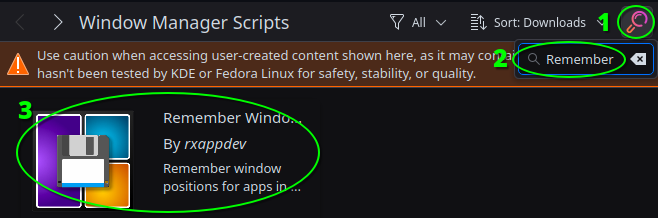<br>
4) Click `Install`<br>
<br>
5) Enable `Remember Window Positions`<br>
<br>
6) Click `Apply`<br>
<br>
7) Click the configure icon to change the settings to your liking<br>
<br>

Please note that changing settings requires some additional steps to apply due to a KDE limitation - see `Changing settings` below for more information.

### <p id="file"></p>From File

You can download the `rememberwindowpositions.kwinscript` file and install it through **System Settings**.
1) Download the .kwinscript file.
2) Open `System Settings` > `Window Management` > `KWin Scripts`.
3) Click the `Install from File...` in upper right corner.<br>
<br>
4) Select the downloaded file and click `Open`
5) Enable `Remember Window Positions`<br>
<br>
6) Click `Apply`<br>
<br>
7) Click the configure icon to change the settings to your liking<br>
<br>

Please note that changing settings requires some additional steps to apply due to a KDE limitation - see `Changing settings` below for more information.

## <p id="setup"></p>Recommended setup

Since there are probably tens of thousands of different applications, it is simply impossible to test how all of them behave.

By default, all applications except those that are blacklisted will be remembered. The blacklisted applications are known to use many windows with the same name that are expected to have different sizes. This will obviously cause issues since they would be resized to last known size.

Recommended usage would be to either use a whitelist or a blacklist. It's also possible to simply adjust other settings and get perfect results. The default configuration should not cause many issues, but it all depends on which applications you use - so some tweaking might be required. Enable logs to find application names to add to the blacklist or the whitelist if you go that route.

### <p id="blacklist"></p>Using Blacklist

* Identify problematic applications.
* Check the application names to add in the log (see "<a href="#names">**Find application names**</a>" below).
* Add them to the Blacklist, one per line.

### <p id="whitelist"></p>Using Whitelist

* Check the application names to add in the log (see "<a href="#names">**Find application names**</a>" below).
* Add applications you would like to remember to the list, one per line.

### <p id="names"></p>Find application names

To find application names to add to the Blacklist, Whitelist or Perfect Multi-Window Restore List, enable the "**Print Application Name To Log**" in the "**General**" tab of the settings.

Then in a terminal (Konsole) run:

    journalctl -f | grep RememberWindowPositions

<br>

## <p id="override"></p>Per Application / Window override

It is possible to configure individual application and windows by pressing the Ctrl+Meta+W key. (On most keyboards Windows key is the Meta key).

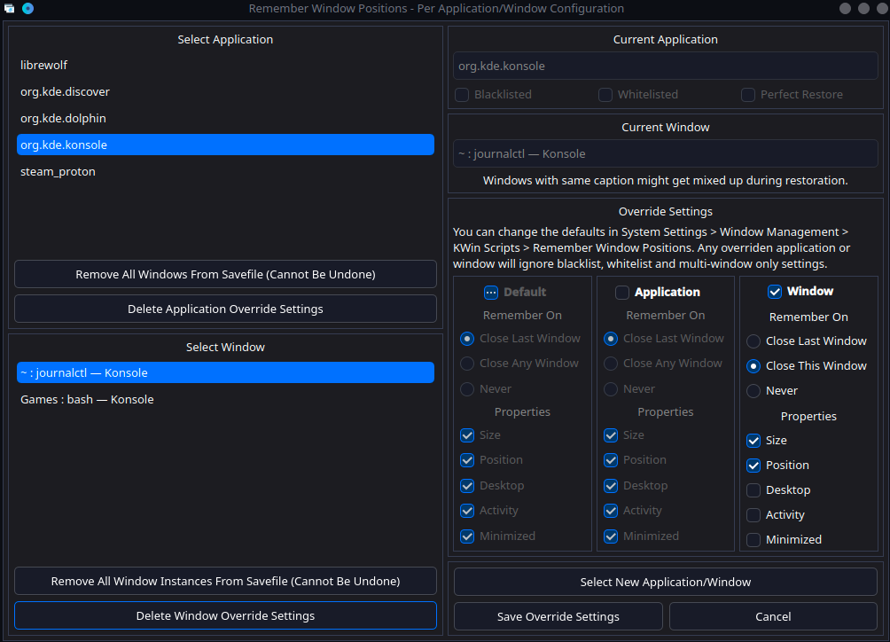<br>

If this keyboard shortcut does not work for you, make sure it is correctly setup in `System Settings` > `Keyboard` > `Shortcuts` > `Window Management` > `Remember Window Positions: Show Config`<br>

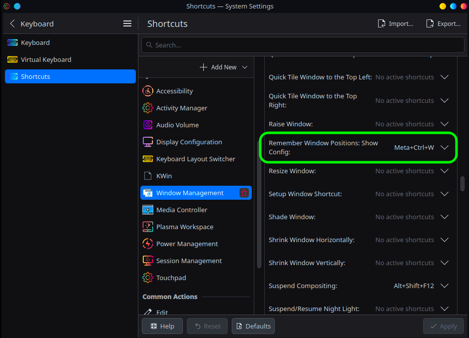<br>

## <p id="system-settings"></p>Changing system settings

### **`IMPORTANT`**

Due to a bug in KDE, changing user configuration requires reloading the script. (A reboot works too.)

To make setting changes effective, **reload the script as follows**:

1) In `System Settings` > `Window Management` > `KWin Scripts`, untick `Remember Window Positions`<br>
<br>
2) Click `Apply`<br>
<br>
3) Tick `Remember Window Positions`<br>
<br>
4) Click `Apply`<br>
<br>

### <p id="remove-settings"></p>Manually erasing settings

If there is ever need to manually erase user data (do not do this unless you are a developer or really need it).

The application/window data is stored in `~/.config/kde.org/kwin.conf` under the key `rememberwindowpositions_windows`.

The system user settings data is stored in `~/.config/kwinrc` under `[Script-krestorewindowpositions]`.

## <p id="use"></p>Use case examples

### <p id="firefox"></p>Remember Firefox/LibreWolf/Waterfox Picture-in-Picture position

1) Open your Firefox-based browser and go to Youtube
2) Start a video and click the Picture-in-Picture button<br>
<br>
3) Open Per Application/Window Configuration (**Ctrl+Meta+W**)
4) Click the `Select Application/Window` button<br>
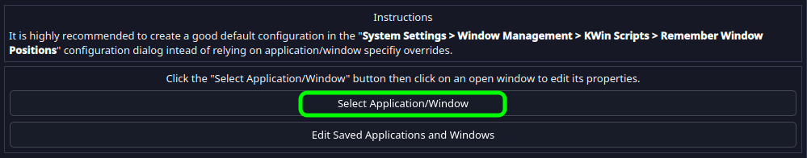<br>
5) Click on the Picture-in-Picture window<br>
<br>
6) Make sure the "`Window`" is checked, "`Close This Window`" is selected and click the "`Save Override Settings`"<br>
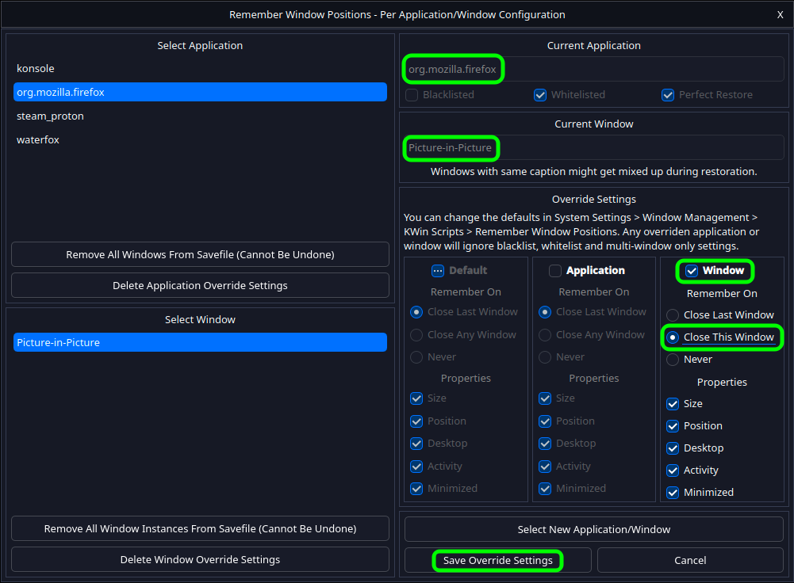<br>

### <p id="browser"></p>Only restore my browser - let other application use system default behavior

1) Open `System Settings` > `Window Management` > `KWin Scripts` > `Remember Window Positions Settings`<br>
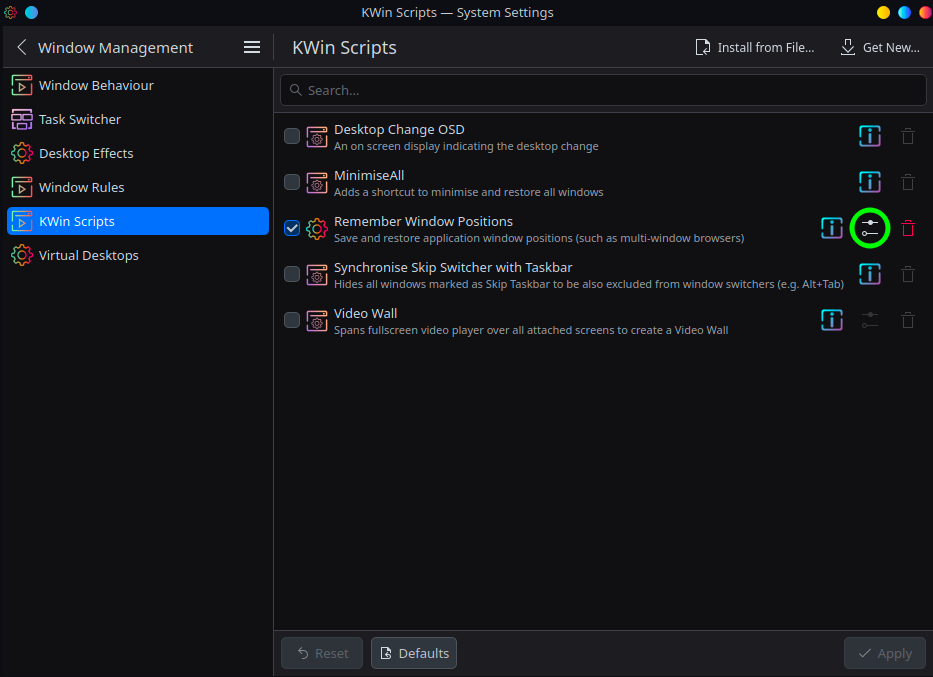<br>
2) Change to `Remember` "`Only whitelisted applications`"<br>
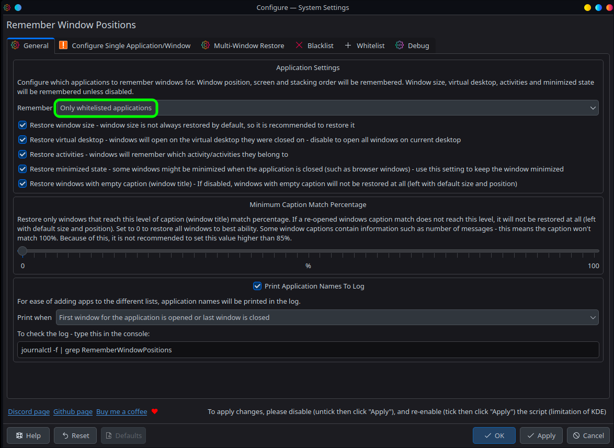<br>
3) Find your browser name (see <a href="#names">`Find application names`</a>") and add it to the whitelist (might be pre-added)<br>
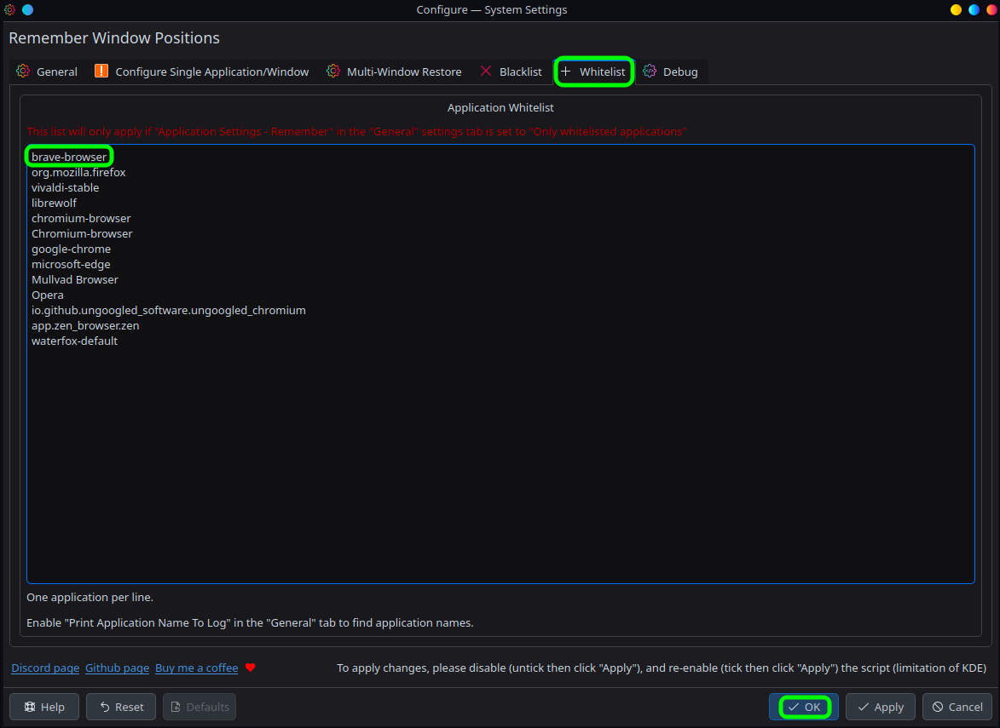<br>
4) Click "`OK`" to save the changes
5) Untick `Remember Window Positions`<br>
<br>
6) Click `Apply`<br>
<br>
7) Tick `Remember Window Positions`<br>
<br>
8) Click `Apply`<br>
<br>

### <p id="desktop"></p>Do not restore virtual desktop for Konsole

1) Open a Konsole window
2) Open Per Application/Window Configuration (**Ctrl+Meta+W**)
3) Click the `Select Application/Window` button<br>
<br>
4) Click on the Konsole window<br>
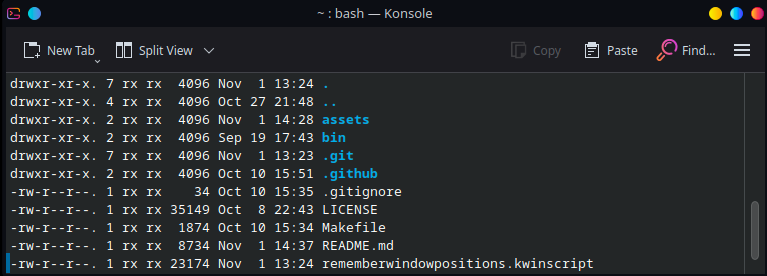<br>
6) Make sure the "`Application`" is checked, "`Close Last Window`" is selected, "`Desktop`" is unchecked and click the "`Save Override Settings`"<br>
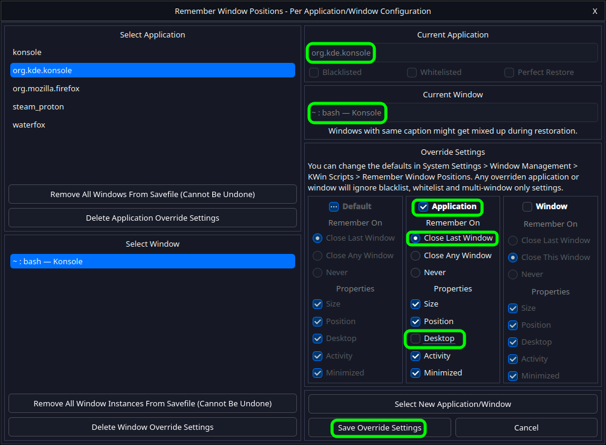<br>

### <p id="caption"></p>Only remember windows that fully match caption (title)

1) Open `System Settings` > `Window Management` > `KWin Scripts` > `Remember Window Positions Settings`<br>
<br>
2) Change the `Minimum Caption Match Percentage` to around 85%. Anything much higher and you will get issues with windows that show number of messages or similar information<br>
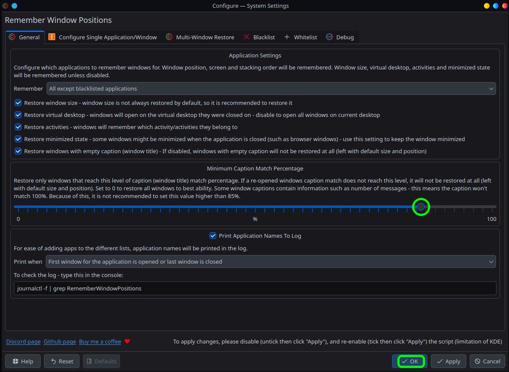<br>
3) Click "`OK`" to save the changes
4) Untick `Remember Window Positions`<br>
<br>
5) Click `Apply`<br>
<br>
6) Tick `Remember Window Positions`<br>
<br>
7) Click `Apply`<br>
<br>

## <p id="troubleshooting"></p>Troubleshooting

### <p id="commandline"></p>Command line

In case there are any issues (such as a crash - which should never happen but just in case), this is how to disable the script from command line (open a console with `Ctrl+Alt+F5`):

```
kwriteconfig6 --file kwinrc --group Plugins --key rememberwindowpositionsEnabled false
qdbus org.kde.KWin /KWin reconfigure
```

If the window configuration contains corrupted data, it can be manually deleted in the file: `~/.config/kde.org/kwin.conf` under key `rememberwindowpositions_windows`.

## <p id="compatibility"></p>Compatibility ##

Compatible with:
* Session Restore - some users report success, however this is not officially supported and one user reported crash loop when restoring a saved session (reported by Equivalent-Cut-9253)

## <p id="getintouch"></p>Get in touch ##

Join the official discord channel https://discord.gg/Js6AYsnQQj to discuss, report bugs or find guides.