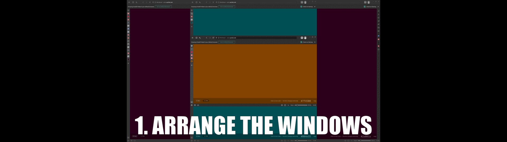

# Remember Window Positions

<pre>KDE KWin Script for remembering application window properties.
Especially useful for multi-window applications such as browsers.
Remembers and restores the windows position, size, screen and virtual desktop.</pre>

* Compatible with KDE Plasma 6+ (compatibility with previous version is unknown).

* Tested on Fedora 42 KDE running Wayland with Plasma version 6.4.5.

## Features

### Automatic restoration of saved windows

The process of saving and restoring a window is extremely simple:

1. Arrange the application windows to your liking
2. Close the application fully
3. Next time the application starts, the windows are restored to best ability

### Customizable

Can operate in one of four modes where it remembers:

- All applications
- All multi-window applications
- All except blacklisted applications (Default)
- Only whitelisted applications (Recommended)

## How it works

1. When the last window of an application is closed, the properties of all windows that were closed within the past second are saved. To save all windows for a browser, simply "Quit" it from the application menu so that all windows are closed at once.

2. Next time the application starts the restoration process begins:
    - Window caption and size are compared to the saved windows.
    - When the captions of all windows match to at least 85% (since a caption can change slightly such as when it contains a number of messages) - the windows are restored to the previous state.

3. The process above is repeated once a second, for a customizable amount of attempts. If it fails to restore the windows with high caption match level, they are instead restored to the best ability.

## Installation

You can download the `rememberwindowpositions.kwinscript` file and install it through **System Settings**.
1) Download the .kwinscript file.
2) Open `Settings` > `Window Management` > `KWin Scripts`.
3) Click the `Install from File...` in upper right corner.
4) Select the downloaded file and click `Open`
5) Enable `Remember Window Positions`
6) Click the configure icon to change the settings to your liking

## Recommended setup

Since there are probably tens of thousands of different applications, it is simply impossible to test how all of them behave.

By default, all applications except those that are blacklisted will be remembered. The blacklisted applications are known to use many windows with the same name that are expected to have different sizes. This will obviously cause issues since they would be resized to last known size.

Recommended usage would be to either use a whitelist (safer) or blacklist (less work).

### Using Blacklist

* Identify problematic applications.
* Check the application names to add in the log (see "Find application names" below).
* Add them to the Blacklist, one per line.

### Using Whitelist

* Check the application name to add in the log (see "Find application names" below).
* Add applications you would like to remember to the list, one per line.

### Find application names

To find application names to add to the Blacklist, Whitelist or Perfect Multi-Window Restore List, enable the "Print Application Name To Log" in the settings, and in a terminal (Konsole) run:

    journalctl -f | grep RememberWindowPositions

## Changing settings

### **!!! IMPORTANT !!!**

Due to a bug in KDE, changing user configuration requires reloading the script.

To make setting changes effective, **reload the script as follows**:

1) In `Settings` > `Window Management` > `KWin Scripts`, untick `Remember Window Positions`
2) Click `Apply`
3) Tick `Remember Window Positions`
4) Click `Apply`